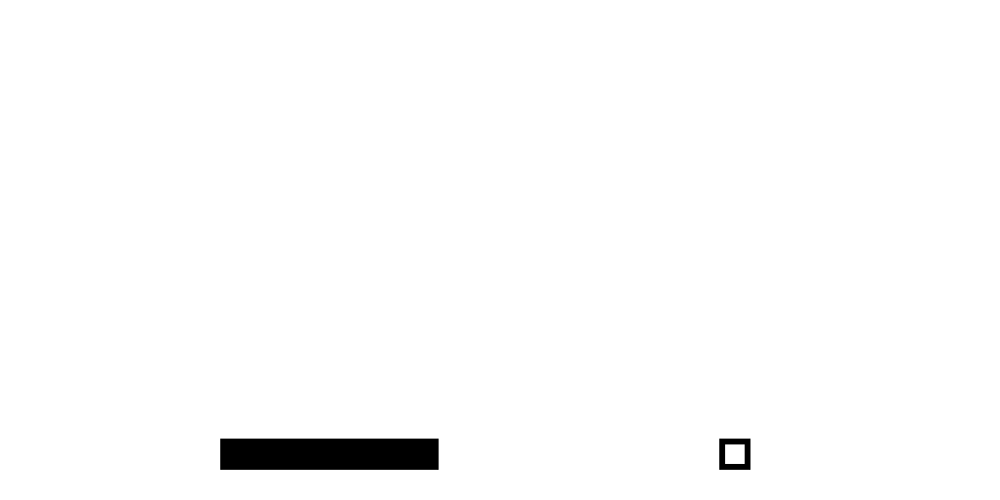

# Nand to Tetris

All project solutions for https://nand2tetris.org

The goal of this course is to design and build a general purpose computer
from the bottom up. First half deals with low level things (from NAND gates to Assembler),
while the second half focuses on a software layer (Compiler, OS, high-level programming)

## Course syllabus
- [Project 1: Boolean Logic](projects/01)
- [Project 2: Boolean Arithmetic](projects/02)
- [Project 3: Sequential Logic](projects/03)
- [Project 4: Machine Language](projects/04)
- [Project 5: Computer Architecture](projects/05)
- [Project 6: Assembler](projects/06)
- [Project 7: VM I: Stack Arithmetic](projects/07)
- [Project 8: VM II: Program Control](projects/08)
- [Project 9: High-Level Language](projects/09)
- [Project 10: Compiler I: Syntax Analysis](projects/10)
- [Project 11: Compiler II: Code Generation](projects/11)
- [Project 12: Operating System](projects/12)

